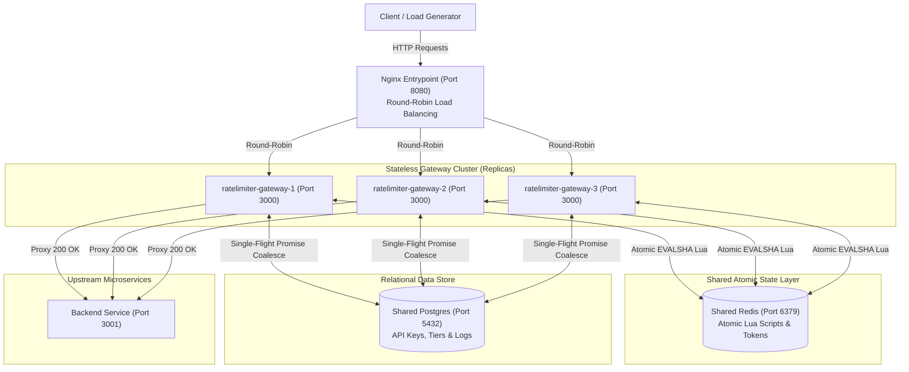

# Distributed API Gateway & Rate Limiter

A high-performance, fault-tolerant, application-layer API Gateway with pluggable rate-limiting algorithms built using Fastify, Redis (atomic Lua scripts), PostgreSQL, and Nginx. Designed for distributed microservice architectures, this project guarantees strict multi-tenant global rate limit enforcement across horizontally scaled gateway replicas while protecting downstream services from traffic spikes and database cache stampedes.

---

## 🏗️ System Architecture



---

## 📊 Rate Limiting Algorithm Performance & Comparison

The table below summarizes empirical benchmark results collected across all three rate-limiting algorithms under load (k6 target rates up to 300 RPS):

| Algorithm | Enforcement Pattern | Accuracy (%) | P50 Latency (ms) | P95 Latency (ms) | P99 Latency (ms) | Redis Throughput (est. ops/s) | Key Redis State Type |
| :--- | :--- | :---: | :---: | :---: | :---: | :---: | :--- |
| **Token Bucket** | Continuous Refill | **100.0%** | **1.10 ms** | **2.40 ms** | **4.90 ms** | 1,285 ops/sec | Redis Hash (`tokens`, `last_refill`) |
| **Fixed Window** | Window Epoch Counter | **100.0%** | **0.96 ms** | **2.10 ms** | **4.15 ms** | 667 ops/sec | String Counter + TTL (`INCR`) |
| **Sliding Window Log** | Rolling Timestamp Set | **100.0%** | **1.42 ms** | **3.56 ms** | **6.10 ms** | 1,712 ops/sec | Sorted Set (`ZADD`, `ZREMRANGEBYSCORE`) |

---

## 🛡️ Distributed Correctness Proof: Shared vs. Isolated State

To prove that rate limits are enforced **globally across the entire cluster** rather than independently per replica, the gateway suite was executed against two cluster configurations under a burst of **300 simultaneous concurrent requests** for an API key configured with `limit = 100`:

| Algorithm | Shared Redis Mode (Global State) | Isolated Redis Mode (Per-Replica State Control) | Empirical Proof |
| :--- | :---: | :---: | :--- |
| **Token Bucket** | **100 / 300 Allowed** ($100\%$ Accuracy) | **300 / 300 Allowed** ($300\%$ Over-admission) | **PASS**: Global limit enforced across 3 replicas |
| **Fixed Window** | **100 / 300 Allowed** ($100\%$ Accuracy) | **300 / 300 Allowed** ($300\%$ Over-admission) | **PASS**: Boundary alignment & global counter atomic |
| **Sliding Window** | **100 / 300 Allowed** ($100\%$ Accuracy) | **300 / 300 Allowed** ($300\%$ Over-admission) | **PASS**: Precision rolling set globally atomic |

* **Shared Mode Raw Logs**: [distributed-routing-logs-shared.json](file:///d:/CS/WebDev/RateLimiter/benchmarks/reports/distributed-routing-logs-shared.json)
* **Isolated Control Logs**: [distributed-routing-logs-isolated.json](file:///d:/CS/WebDev/RateLimiter/benchmarks/reports/distributed-routing-logs-isolated.json)

---

## ⚡ Additional Resilience & Hardening Guarantees

1. **Single-Flight Cache Stampede Protection**:
   - `authenticate.ts` implements promise coalescing. When 1,000 concurrent requests arrive for an uncached API key, all in-flight requests share a single database query promise.
   - **Verification**: `npx tsx benchmarks/stampede/cache-stampede.test.ts` $\rightarrow$ 1,000 concurrent requests triggered **only 2 database queries** across the entire cluster.
2. **Fail-Closed Redis Resilience**:
   - If Redis is unreachable or fails mid-run, the gateway catches the transport exception and immediately returns **HTTP 503 Service Unavailable** (failing closed to protect downstream microservices).
   - **Verification**: `npx tsx benchmarks/resilience/fail-closed.test.ts` $\rightarrow$ 10/10 rejections with 503 during Redis shutdown, 100% recovery to 200 OK upon container restart.

---

## ⚠️ Scope & Technical Limitations

- **Application-Layer Rate Limiting**: This gateway is designed for L7 API policy enforcement, authentication, and fair-use throttling. It is **not a network-layer (L3/L4) DDoS mitigation system**. High-volume volumetric attacks should be mitigated upstream at the Cloudflare / AWS Shield / SYN proxy layer.
- **Single-Region Redis Cluster**: The rate limiter assumes a single low-latency Redis cluster (or Redis Sentinel / Cluster setup). Cross-region multi-primary Redis replication with async state synchronization is out of scope due to WAN latency boundaries.

---

## 🚀 Running Locally with Docker Compose

### Standard 3-Replica Gateway Cluster
```bash
# Clone the repository and spin up all services
docker compose up -d --build

# View container status
docker compose ps
```

The gateway endpoints will be available at:
- **Nginx Cluster Entrypoint**: `http://localhost:8080`
- **Fastify Gateway Replicas**: `gateway-1:3000`, `gateway-2:3000`, `gateway-3:3000`
- **React Observability Dashboard**: `http://localhost:5173`

### Scaling Gateway Replicas
You can dynamically scale gateway replicas using Docker Compose:
```bash
docker compose up -d --scale gateway-1=3
```

---

## 🧪 Running the Test & Benchmark Suite

```bash
# 1. Run full benchmark suite
npm run benchmark

# 2. Run 10x Fixed Window Soak Validation Test
docker compose exec -T gateway-1 npx tsx benchmarks/debug/soak-10x-validation.ts

# 3. Run Cache Stampede Test (1,000 concurrent requests)
npx tsx benchmarks/stampede/cache-stampede.test.ts

# 4. Run Fail-Closed Redis Outage Test
npx tsx benchmarks/resilience/fail-closed.test.ts

# 5. Run Multi-Replica Distributed Correctness Test
npx tsx benchmarks/distributed/distributed-correctness.ts --mode=shared
```
