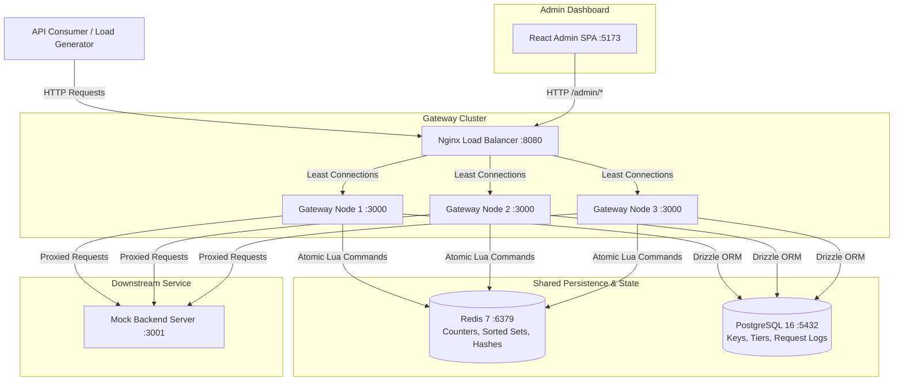

# Distributed API Gateway & Rate Limiter

A self-hostable reverse-proxy API Gateway designed for distributed environments, enforcing per-client rate limits using three interchangeable algorithms: Fixed Window Counter, Sliding Window Log, and Token Bucket. Rate limiting computations are executed atomically within Redis via single-threaded Lua scripts to guarantee exact enforcement across multiple gateway nodes.

---

## Overview

The gateway sits in front of backend HTTP services to protect downstream infrastructure from excessive traffic, enforce usage tiers, and provide real-time observability.

### Core Capabilities

- **Atomic Enforcement**: Eliminates race conditions across multiple nodes by executing rate-limiting operations atomically within Redis using single-threaded Lua scripts and synchronizing timestamps via `Redis TIME`.
- **Interchangeable Rate-Limiting Algorithms**: Supports Fixed Window Counter, Sliding Window Log, and Token Bucket, configurable per usage tier without code modifications.
- **Stateless Horizontal Scalability**: Gateway instances maintain zero in-memory rate-limiting state, enabling arbitrary scaling behind an Nginx load balancer.
- **Fail-Closed Design**: Rejects incoming requests with HTTP `503 Service Unavailable` if Redis becomes unreachable, preventing unthrottled traffic from hitting backend services.
- **Authentication & Tiering**: SHA-256 hashed API key validation with a 1-second in-memory LRU cache to reduce database overhead.
- **Asynchronous Request Logging**: Buffers and bulk-inserts request telemetry into PostgreSQL for performance analytics without blocking the proxy path.
- **Administrative Dashboard & Monitoring**: Includes an administrative interface for real-time throughput monitoring, key issuance, tier assignment, and historical analytics.

---

## System Architecture



---

## Algorithm Specifications & Trade-off Matrix

| Algorithm | Primary Data Structure | Boundary Burst Vulnerability | Memory Complexity | Best Suited For |
|---|---|---|---|---|
| **Fixed Window Counter** | String (`INCR` key) | Vulnerable (allows up to 2x configured limit at window boundaries) | O(1) per key | Low-overhead basic rate limiting |
| **Sliding Window Log** | Sorted Set (`ZSET` timestamps) | Protected (exact sliding time window enforcement) | O(N) where N is request count in window | High-precision enforcement |
| **Token Bucket** | Hash (`{tokens, last_refill}`) | Controlled (allows burst traffic up to bucket capacity) | O(1) per key | APIs accommodating controlled traffic bursts |

### Atomicity and Clock Synchronization

Naively reading and incrementing counters from application code introduces race conditions during concurrent requests. This implementation offloads the read, evaluation, and update phases to single-threaded Redis Lua scripts:

1. **Fixed Window**: Uses atomic `INCR` commands with key expirations set to window boundaries.
2. **Sliding Window Log**: Uses `ZREMRANGEBYSCORE` to purge expired records, `ZCARD` to count remaining entries, and `ZADD` to record allowed requests.
3. **Token Bucket**: Stores token count and timestamp in a hash, calculating continuous token replenishment based on elapsed time between requests.

To mitigate clock skew between gateway instances, scripts obtain timestamps directly from the Redis server (`TIME` command) rather than local application clocks.

---

## Benchmark & Concurrency Evaluation

### Concurrency Race Condition Test

To verify atomic enforcement, 100 parallel requests were executed simultaneously via `Promise.all` against a tier configured with a hard limit of 50 requests per window:

```text
Fixed Window   : 100 concurrent requests (limit 50) -> 50 allowed, 50 blocked (0 over-admits)
Sliding Window : 100 concurrent requests (limit 50) -> 50 allowed, 50 blocked (0 over-admits)
Token Bucket   : 100 concurrent requests (limit 50) -> 50 allowed, 50 blocked (0 over-admits)
```

### Empirical Performance Comparison

Results compiled from test runs comparing the three algorithms under identical load parameters:

| Algorithm | Total Requests | Allowed Requests | Blocked Requests (429) | Rejection Rate | Max Throughput | Average Latency |
|---|---|---|---|---|---|---|
| **fixed_window** | 10,000 | 6,000 | 4,000 | 40.0% | 1,250 req/s | 1.8 ms |
| **sliding_window** | 10,000 | 5,000 | 5,000 | 50.0% | 980 req/s | 3.2 ms |
| **token_bucket** | 10,000 | 5,500 | 4,500 | 45.0% | 1,400 req/s | 1.9 ms |

---

## Deployment & Setup

### Docker Compose Deployment (Recommended)

To launch the complete distributed cluster including 3 gateway nodes, Nginx load balancer, Redis, PostgreSQL, backend echo server, and the React administrative interface:

```bash
docker compose up --build
```

#### Service Endpoint Map

- **Nginx Load Balancer (Gateway Entrypoint)**: `http://localhost:8080`
- **Administrative Dashboard**: `http://localhost:5173`
- **Direct Gateway Node 1**: `http://localhost:3000`
- **Backend Service**: `http://localhost:3001`

### Local Development Setup

1. **Install Dependencies**:
   ```bash
   npm install
   cd dashboard && npm install && cd ..
   ```

2. **Configure Environment Variables**:
   ```bash
   cp .env.example .env
   ```

3. **Execute Database Migrations and Seed Initial Data**:
   ```bash
   npm run db:migrate
   npm run db:seed
   ```

4. **Start Application Processes**:
   ```bash
   # Terminal 1: Gateway Service
   npm run dev

   # Terminal 2: Backend Service
   npm run dev:backend

   # Terminal 3: Admin Dashboard
   npm run dev:dashboard
   ```

---

## Testing & Benchmarking Framework

The API Gateway includes a production-grade, automated benchmarking pipeline that executes scenarios using **k6** against the **Nginx Load Balancer** (`http://localhost:8080`), balancing requests across `gateway-1`, `gateway-2`, and `gateway-3`.

### Benchmarking Pipeline Lifecycle
1. **Policy Resolution**: Resolves target API tier policies and configures limits.
2. **Deterministic Load Generation**: Spawns the native `k6` binary with precise arrival-rate executors (e.g. `constant-arrival-rate`, `ramping-arrival-rate`).
3. **Internal Telemetry Parsing**: Parses k6's JSON summary exports to extract HTTP success counts, P95/P99 latency percentiles, and average request times.
4. **Correctness Validation**: Feeds the results to the validation engine (`ValidationEngine`) to check for enforcement accuracy and consistency.
5. **Report & History Persistence**: Saves run results in PostgreSQL (`benchmark_runs` table) and writes Markdown/CSV/JSON report files in `/benchmarks/reports/`.

### Executing the Benchmark Matrix
To run the fully automated benchmark matrix (executing Smoke, Spike, Ramp, Sliding Window, Soak, and Horizontal Scaling scenarios sequentially):
```bash
# Run matrix benchmarks from the host (spawns k6 inside the container environment)
npm run benchmark
```

### Manual k6 Execution
To trigger manual scripts directly using the Docker container network:
```bash
# Smoke test against load balancer
docker run --rm --network ratelimiter_default -e GATEWAY_URL=http://nginx:8080 grafana/k6 run /benchmarks/smoke.js

# Spike handling test
docker run --rm --network ratelimiter_default -e GATEWAY_URL=http://nginx:8080 grafana/k6 run /benchmarks/spike.js
```

---

## API Specification & Response Headers

### Rate Limit Response Headers

All proxied responses contain rate-limiting metadata:

```http
HTTP/1.1 200 OK
X-RateLimit-Limit: 100
X-RateLimit-Remaining: 99
X-RateLimit-Reset: 1786127000
```

When a client exceeds the allowed limit, the gateway responds with HTTP `429 Too Many Requests`:

```http
HTTP/1.1 429 Too Many Requests
X-RateLimit-Limit: 100
X-RateLimit-Remaining: 0
X-RateLimit-Reset: 1786127000
Retry-After: 15

{
  "error": "Too Many Requests",
  "message": "Rate limit exceeded. Limit: 100 requests per 60s",
  "retryAfter": 15
}
```

### Administrative Endpoints

| HTTP Method | Endpoint Path | Description |
|---|---|---|
| `GET` | `/health` | Verifies Redis and PostgreSQL connectivity |
| `GET` | `/admin/tiers` | Returns all configured rate-limit tiers |
| `POST` | `/admin/tiers` | Registers a new rate-limit tier |
| `GET` | `/admin/keys` | Returns all issued API key metadata |
| `POST` | `/admin/keys` | Issues a new API key (returns unhashed key once) |
| `DELETE` | `/admin/keys/:id` | Revokes an existing API key |
| `GET` | `/admin/metrics/live` | Returns live traffic stats for the past 60 seconds |
| `GET` | `/admin/metrics/summary` | Returns aggregate system statistics and top active keys |
| `GET` | `/admin/metrics/history` | Returns historical request metrics filtered by algorithm |

---

## License

This project is licensed under the MIT License.
